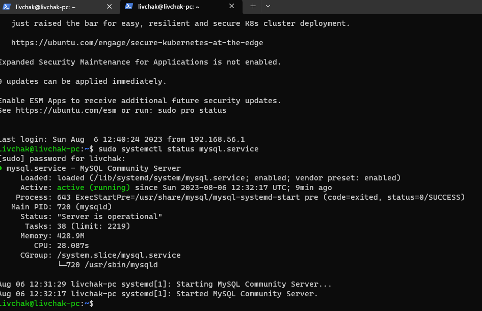
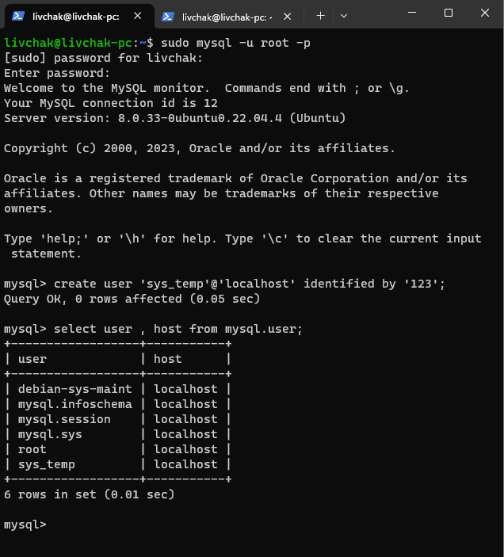
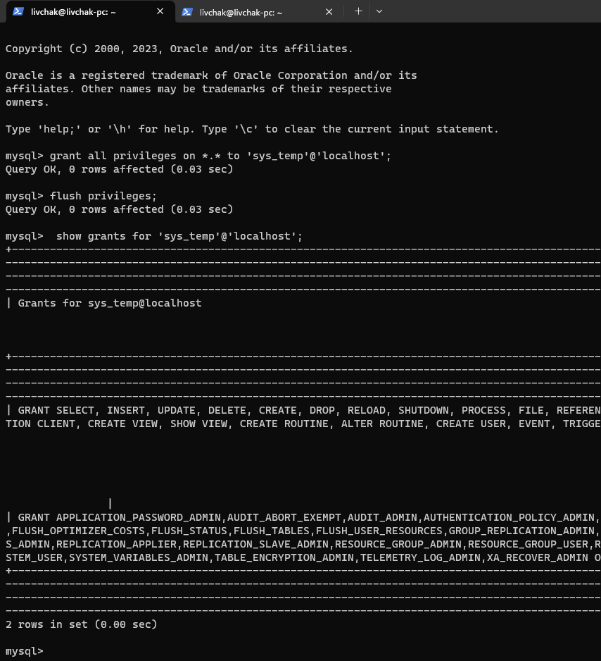
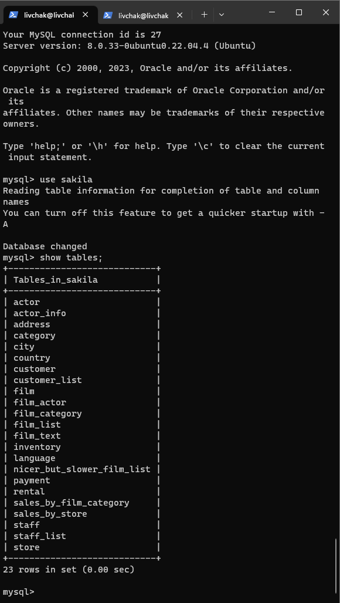
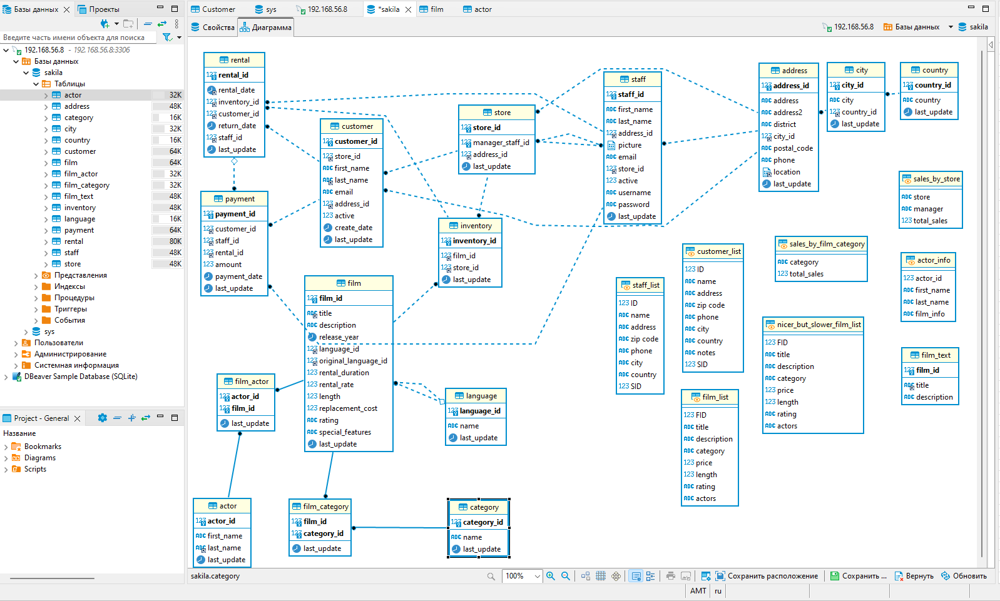
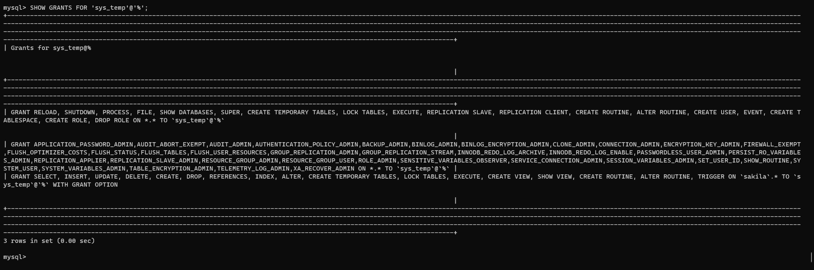
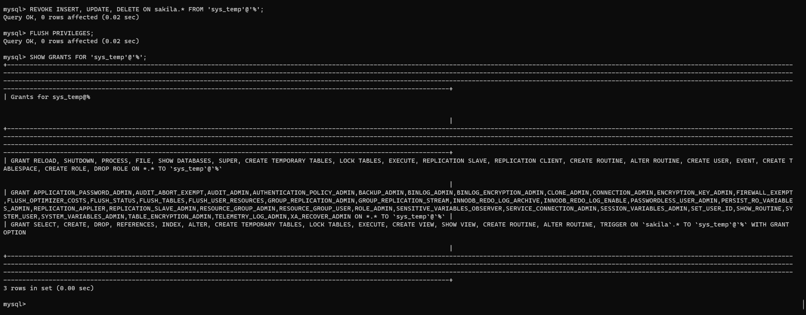

# Домашнее задание к занятию "`12-02hw`" - `Ливчак Сергей`

---

### Задание 1

`Установка и настройка MYSQL`

1. `Поднять MYSQL, создать пользователя и проверить список пользователей`
**MYSQL service** 


**Манипуляции с пользователем** 


2. `Дайте все права для пользователя и посмотрите список прав`
**Манипуляции с правами пользователя** 


3. `Восстановите дамп в базу данных`
**список таблиц** 



4. `Вывести ER-диаграмму`
**ER-диаграмма** 


---

### Задание 2

`Составьте таблицу, используя любой текстовый редактор или Excel, в которой должно быть два столбца: в первом должны быть названия таблиц восстановленной базы, во втором названия первичных ключей этих таблиц`

```
Database changed
mysql> SELECT * FROM zadanie2;
+---------------+------------------+
| table_name    | name_primary_key |
+---------------+------------------+
| actor         | actor_id         |
| address       | address_id       |
| category      | category_id      |
| city          | city_id          |
| country       | country_id       |
| customer      | customer_id      |
| film          | film_id          |
| film_actor    | actor_id         |
| film_actor    | film_id          |
| film_category | film_id          |
| film_category | category_id      |
| film_text     | film_id          |
| inventory     | inventory_id     |
| language      | language_id      |
| payment       | payment_id       |
| rental        | rental_id        |
| staff         | staff_id         |
| store         | store_id         |
+---------------+------------------+
18 rows in set (0.00 sec)

```
Ссылка на скрипт для создания этой таблицы.
[hw-12-2_Script.sql](txt/Script.sql) 

Ссылка на простыню процесса выполнения.
[hw-12-2_sheet_script.txt](txt/sheet_script.txt) 

---

## Дополнительные задания (со звездочкой*)

### Задание 3

`Уберите у пользователя sys_temp права на внесение, изменение и удаление данных из базы sakila`

1. `запрос прав у пользователя sys_temp`
**show grants** 


2. `убираем права на внесение, изменение и удаление данных из базы sakila`
**revoke** 
